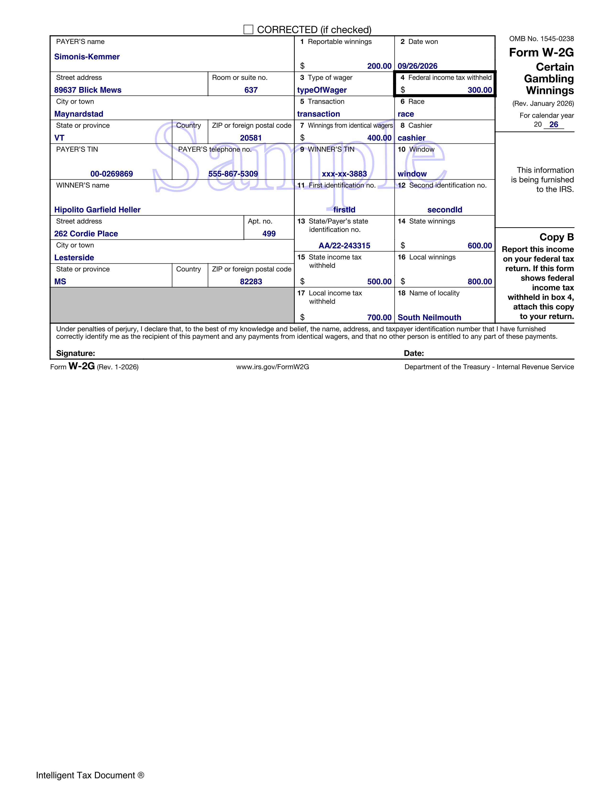
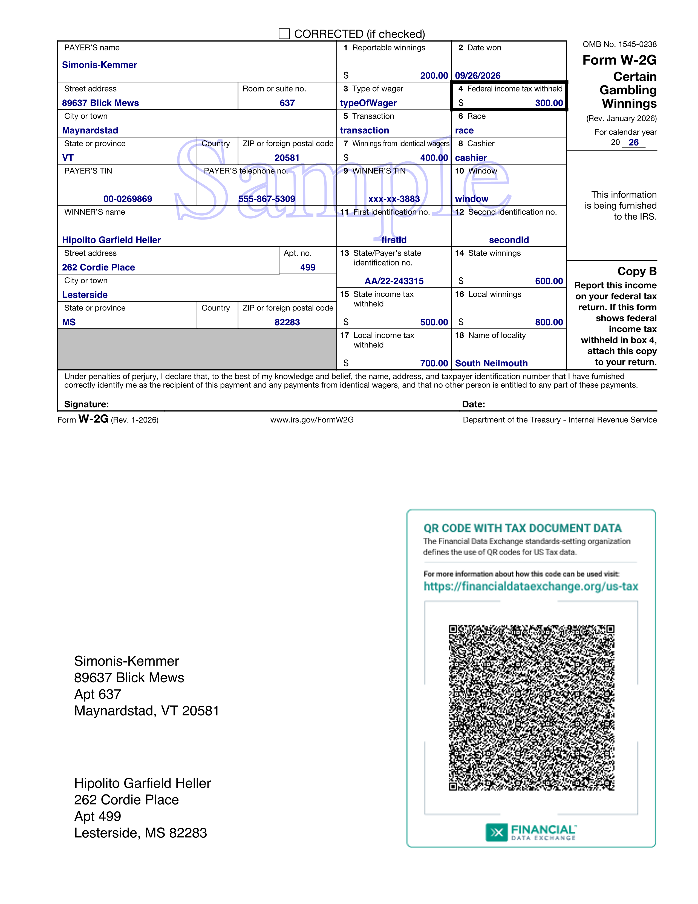

# tax-doc-sdk-taxw2g for tax year 2026

https://github.com/iTipsDev/tax-doc-sdk-taxw2g

Java software development kit to generate IRS Form W-2G, Certain Gambling Winnings, in portable document format (PDF)

<p>Supports production of PDF files with embedded JSON, also known as Intelligent Tax Documents<sup>&reg;</sup></p>

Supports production of PDF files with QR codes

Supports CSV file as input

Uses Financial Data Exchange (FDX) tax version 6.6.0 standard data structures

### Intelligent Tax Document



### QR Tax Document



### Maven Dependency

This GitHub project is public but the Maven repository on which it relies is private

Go to https://www.taxdataexchange.org/developer-sdks.html to purchase a subscription to use the SDK and related Maven repository


### Maven Artifacts - Google Artifact Registry Access

Access to the Maven artifacts in Google Artifact Registry require the following, one-time, set up.

Upon ordering the SDK, you indicate the email of the developer or the email of the Google service account that will be using the artifact. We grant the permission necessary to access the repository to that account.


### Obtain Credentials --> JSON File --> Environment Variable
 
Obtain a json file with the credentials corresponding to the developer or service account email (see below)
 
Create a GOOGLE_APPLICATION_CREDENTIALS environment variable that points to the file. For example:

```
export GOOGLE_APPLICATION_CREDENTIALS='/Users/johnjones/.config/gcloud/application_default_credentials.json'
```

### Getting Credentials for Your Google Account (for Your Email Address)

At a terminal prompt, type

```
gcloud auth application-default login
```

The gcloud program will prompt you to authorize creation of a credentials file. 

It will then save the file and display the path to the file.


### GCloud CLI 

The above assumes you have installed the Google Cloud Command Line Interface (CLI) on your system.

See the installation instructions at:

https://cloud.google.com/sdk/docs/install


